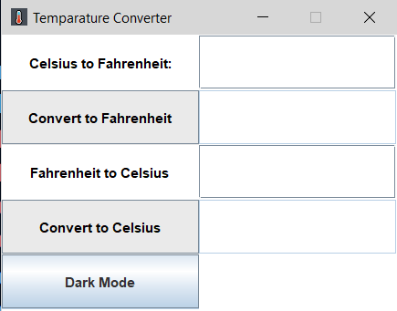
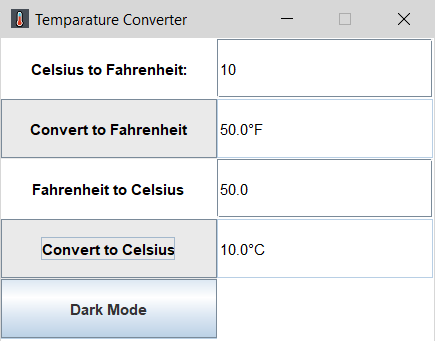

# Temparature converter 🌡️
- Converts Celcius into Fahrenheit
- Converts Fahrenheit into Celsius

## Features
- Add Dark mode Light mode switcher
## Screenshots
### Light mode

### Dark mode

### Output

